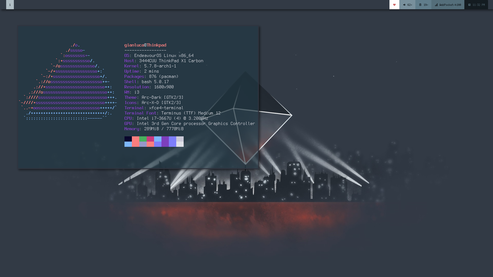

## Desktop Configuration

I use a Thinkpad X1 Carbon 1st Gen and EndeavourOS (Arch) and XFCE as DE, but I mainly use i3gaps as Windows manager, Polybar as status bar and Picom as composer.

PC Specs:
- EndeavourOS
- XFCE
- i3gaps w/ Picom and Polybar
- i7 3rd Gen
- 8GB Ram
- 180GB SSD

This is a very minimal and simple configuration, based on the wallpaper found at https://www.zerochan.net/1798586, by yugiohgirl, that represent Ramiel, the fifth Angel of Neon Genesis Evangelion. I literally fell in love with this wallpaper. The Polybar theme is by Aditya Shakya ([repo](https://github.com/adi1090x/polybar-themes)).